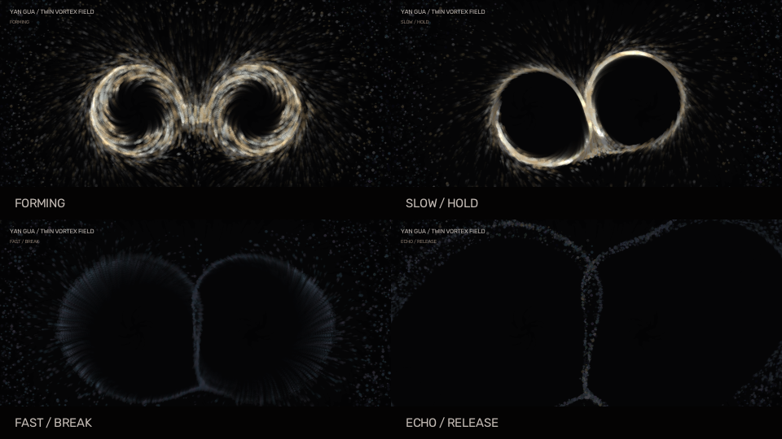

# 演卦 YanGua

> 面向太极拳动作意象的实时双生涡场

[](https://github.com/ly99LLL/taichi/actions/workflows/ci.yml)
[](https://www.python.org/)
[](#项目状态与边界)
[](LICENSE)

[快速开始](#快速开始) · [太极拳语义](#太极拳语义映射) · [运行方式](#运行方式) ·
[系统架构](#系统架构) · [参与贡献](#参与贡献) · [安全与隐私](#安全与隐私)

**演卦（YanGua / Twin Vortex Field）** 是一个由双手驱动的实时星尘交互系统。
它不把太极拳离散成一组需要“识别成功”的固定手势，而是持续读取双手的位置、速度、
纵深和在场状态，将动作中的连绵、开合、虚实与快慢转换为可见的粒子流场。

慢则聚旋，快则解旋；双手同场时形成一对反向涡场，手离开后仍留下逐渐消散的余势。



> 上图由仓库内置的确定性合成轨迹生成，不读取摄像头，也不包含真人影像。

## 项目定位

太极拳的动作价值不只存在于某个静止姿态，还存在于动作之间的转换：起与落、开与合、
蓄与发、显与隐。演卦尝试把这种连续关系转译为实时视觉反馈，而不是只在检测到预设拳式
时触发一次动画。

系统适合用于：

- 太极拳课堂、工作坊中的动作节奏与连续性辅助展示；
- 武术文化展陈、数字艺术装置与现场表演；
- 太极拳动作语言与生成式视觉之间的交互研究；
- 不含真人素材的粒子场演示、录屏和视觉实验。

系统目前不用于：

- 识别或判定具体拳式、流派和套路；
- 对动作质量、发力方式或学习效果进行自动评分；
- 提供医疗、康复、运动安全或专业教学诊断；
- 替代教师对身法、步法、呼吸和整体劲路的观察。

## 快速开始

### 1. 环境准备

需要 64 位 CPython 3.11 或 3.12，以及 JDK 17 或更高版本（推荐 JDK 21）。

```bash
git clone https://github.com/ly99LLL/taichi.git
cd taichi
python -m venv .venv
```

激活虚拟环境：

```powershell
# Windows PowerShell
.\.venv\Scripts\Activate.ps1
```

```bash
# macOS / Linux
source .venv/bin/activate
```

### 2. 安装与运行

```bash
python -m pip install --upgrade pip
python -m pip install -e .
python -m yan_gua
```

首次运行时，操作系统可能要求允许终端或 IDE 访问摄像头。Windows 也可双击
`run.bat`；macOS / Linux 可使用 `bash run.sh`。

## 太极拳语义映射

演卦不是太极拳理论的数字化裁判，而是根据项目的视觉语言，对部分动作意象做如下映射：

| 太极拳动作意象 | 系统观测 | 视觉反馈 |
|---|---|---|
| 连绵不断 | 手部持续出现且轨迹连续 | 粒子始终常驻，涡场在阶段间平滑过渡 |
| 圆活运行 | 掌心位置缓慢移动 | 尘埃聚集到掌心外缘的空心轨道 |
| 动静相因 | 速度在缓慢、加速和急停之间变化 | 相干涡环、解旋破碎与惯性泼洒相互转换 |
| 开合进退 | 手部纵深变化 | 轨道尺度和环流强度产生连续变化 |
| 阴阳相济 | 两只手同时参与 | 两个身份槽以相反旋向组织粒子 |
| 虚实转换 | 手部从观测到暂时丢失 | 实涡转为余涡，不会在丢检瞬间消失 |

这些映射描述的是当前系统的交互设计，不等同于对太极拳技术标准的定义。

## 核心机制

### 常驻粒子

7200 个粒子始终存在于场中。手出现或消失只改变粒子的组织度、动量、亮度和可见度，
不会在掌心位置批量生成或销毁粒子。

### 稳定双手身份

`MotionAnalyzer` 固定维护两个身份槽。即使 MediaPipe 的检测顺序发生变化，两个涡旋的
身份和旋向也不会随帧交换：slot 0 为 `+1`，slot 1 为 `-1`。

### 涡场生命周期

| 阶段 | 含义 | 视觉状态 |
|---|---|---|
| `forming` | 手刚进入或重新出现 | 低亮度尘场逐渐成核 |
| `holding` | 动作缓慢且稳定 | 旧金色相干涡环 |
| `dispersing` | 手速超过解旋区间 | 冷蓝色剪切、破碎与外散 |
| `echo` | 手暂时离开或检测丢失 | 蓝灰色余涡沿惯性衰减 |
| `dormant` | 余涡衰减完成 | 粒子回归低亮度背景尘场 |

缺手状态必须经过 `echo`，不会直接关闭物理场。短暂丢检时，系统还会使用有限时长的
运动预测，减少高速动作造成的视觉断裂。

## 运行方式

### 实时摄像头

```bash
python -m yan_gua
```

### 视频输入与录制

```bash
# 使用视频文件替代摄像头；默认按摄像头视角水平镜像
python -m yan_gua --video "输入视频.mp4"

# 输入视频已经水平镜像
python -m yan_gua --video "输入视频.mp4" --no-mirror

# 录制主窗口；输出不包含音频
python -m yan_gua --video "输入视频.mp4" --record "输出视频.mp4"
```

### 离线与合成渲染

```bash
# 使用视频做本地追踪，但不在结果中显示原视频小窗
python scripts/render_video.py "输入视频.mp4" "效果视频.mp4" --no-camera

# 生成不读取摄像头、不包含真人的合成演示
python scripts/render_demo.py
```

### 计算后端

所有入口使用统一的 `--arch` 参数：

| 运行环境 | 推荐参数 |
|---|---|
| macOS / arm64 | `--arch auto` 或 `--arch metal` |
| macOS / x86_64 | `--arch auto` 或 `--arch cpu` |
| Windows / Linux + NVIDIA GPU | `--arch auto` 或 `--arch cuda` |
| Windows / Linux + Intel / AMD GPU | `--arch auto` 或 `--arch vulkan` |
| 无可用 GPU 或虚拟机 | `--arch cpu` |

`auto` 是默认值。可用选项为 `auto`、`cpu`、`cuda`、`metal`、`vulkan` 和 `opengl`。
CPU 模式功能完整，但实时帧率通常低于 GPU 模式。

Python 与 Java 必须使用相同处理器架构。程序启动时会检查版本和架构，避免混用 arm64
与 x86_64 运行时。

### 交互控制

| 按键 / 控件 | 功能 |
|---|---|
| `ESC` | 退出 |
| `F` | 切换全屏 |
| `D` | 显示相干性、破碎度和生命周期 |
| 右上角按钮 | 重置粒子场 |

使用 `python -m yan_gua --help` 或对应脚本的 `--help` 查看完整参数。

## 系统架构

```text
摄像头 / 视频 / 合成轨迹
          │
          ├─ 图像输入 → CLAHE → MediaPipe Hands / Pose
          ▼
   MotionAnalyzer
   固定身份槽 + 位置 / 速度 / 曲率 / 纵深
          ▼
   VortexController
   forming / holding / dispersing / echo
          ▼
   Taichi Kernel（7200 个常驻粒子）
   尘场 / 双涡环 / 解旋 / 余势 / 弹性碰撞
          │
          ├─ py5：实时窗口
          └─ OpenCV：离线与合成渲染
```

`MotionAnalyzer.process()` 始终返回两个身份槽。短时运动补位由 `predicted` 标记，
`hand_detected` 仅用于 UI 迟滞；涡场生命周期统一由 `VortexController` 管理。

## 配置

主要参数集中在 `yan_gua/config.py`：

| 参数 | 默认值 | 作用 |
|---|---:|---|
| `PARTICLE_COUNT` | 7200 | 常驻粒子数量 |
| `VORTEX_ORBIT_RADIUS` | 92 | 稳定涡环半径 |
| `VORTEX_SLOW_SPEED` | 135 | 开始降低相干性的速度 |
| `VORTEX_BREAK_SPEED` | 480 | 完全解旋的速度 |
| `VORTEX_FORM_SECONDS` | 0.24 | 新涡旋成核时间 |
| `VORTEX_ECHO_SECONDS` | 2.4 | 余涡衰减时间尺度 |
| `VORTEX_HAND_CARRY` | 0.78 | 粒子继承手部速度的比例 |
| `TRAIL_ALPHA` | 24 | 帧缓冲拖尾衰减 |

调参时应保持慢手成环、快手解旋和缺手留余涡三项语义不被破坏。

## 项目结构

```text
yan_gua/
├── motion.py            双手身份、速度、曲率与纵深分析
├── vortex.py            涡场生命周期和连续状态
├── physics.py           Taichi 常驻粒子物理
├── tracking.py          MediaPipe Hands / Pose 追踪
├── camera_renderer.py   摄像头识别光效
├── offline_renderer.py  OpenCV 离线粒子渲染
├── sketch.py            py5 实时交互窗口
└── runtime.py           Java、平台和计算后端检查

scripts/                 视频渲染和无真人合成演示
tests/                   CPU 测试与可选 CUDA 集成测试
docs/assets/             已确认可公开、无人物的 README 素材
```

## 开发与质量检查

```bash
python -m pip install -e ".[dev]"
ruff check .
ruff format --check .
python -m pytest tests/ -m "not cuda" -v
```

CUDA 硬件测试默认关闭。设置 `YANGUA_RUN_CUDA_TESTS=1` 后运行：

```bash
python -m pytest tests/test_physics_cuda.py -m cuda -v
```

CI 在 Python 3.11 和 3.12 上执行静态检查、格式检查、非 CUDA 测试和覆盖率统计。

## 安全与隐私

- 摄像头帧默认仅在本机进程内处理，项目不包含上传或遥测逻辑。
- 只有显式使用 `--record` 时，实时程序才会写入录制文件。
- 原始视频、录制结果、逐帧调试图、构建产物和本地展示材料均由 `.gitignore` 排除。
- `docs/assets/` 只接受已确认可公开、无人物、无个人信息的演示素材。
- 提交前应检查媒体元数据、绝对路径、邮箱、访问令牌、密钥和第三方肖像。

未公开的安全问题请按[安全政策](SECURITY.md)私下报告，不要创建公开 Issue。

## 项目状态与边界

当前版本处于 Beta 阶段。粒子物理、视觉参数和追踪降级策略仍可能调整。

已知限制：

- 系统关注双手与腕部可见信息，尚未完整建模太极拳的步法、重心、躯干、呼吸和劲路；
- MediaPipe 识别质量会受到遮挡、逆光、手部尺寸和摄像头帧率影响；
- GPU 后端的可用性和性能取决于 Taichi、操作系统与显卡驱动；
- MP4 录制不保留输入音频，需要在本地后期合并。

## 参与贡献

欢迎提交缺陷修复、跨平台改进、测试、文档和符合项目语义的视觉优化。

- 提交代码前请阅读[贡献指南](CONTRIBUTING.md)；
- 所有参与者需遵守[行为准则](CODE_OF_CONDUCT.md)；
- 缺陷与功能建议通过 [GitHub Issues](https://github.com/ly99LLL/taichi/issues) 提交；
- 重要版本变化记录在[更新日志](CHANGELOG.md)中。

视觉或交互改动应说明它如何服务于太极拳的连续性表达，并确保实时、离线和合成模式复用
同一套核心逻辑。

## 技术基础

本项目主要建立在以下开源项目之上：

- [Taichi](https://github.com/taichi-dev/taichi)：GPU / CPU 粒子计算；
- [MediaPipe](https://github.com/google-ai-edge/mediapipe)：手部与姿态追踪；
- [py5](https://py5coding.org/)：实时交互窗口；
- [OpenCV](https://github.com/opencv/opencv)：摄像头、图像处理与离线视频。

## 许可证

本项目采用 [MIT License](LICENSE)。
