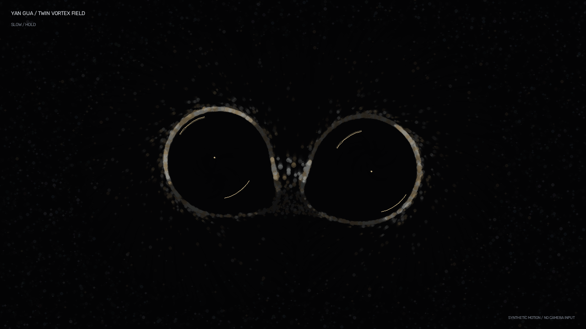

# 演卦 · 双生涡场

[](https://github.com/ly99LLL/taichi/actions/workflows/ci.yml)
[](https://www.python.org/)
[](LICENSE)

**演卦（YanGua / Twin Vortex Field）** 是一个由双手驱动的实时星尘涡旋系统。
它不识别固定招式，而是把手速、轨迹和纵深变化转换为具有生命周期的双生流场：
慢手维持相干涡环，快手使其破碎，检测丢失后仍保留连续衰减的余涡。



> 上图由仓库内置的确定性合成轨迹生成，不读取摄像头、不含真人影像。画面中的粒子
> 始终常驻；手势只改变它们的组织度、速度与可见度。

## 特性

- **双手稳定身份**：固定维护左右两个槽位，MediaPipe 返回顺序变化时不会交换涡旋。
- **连续涡场生命周期**：统一处理成核、保持、解旋、余涡和重新成核。
- **常驻粒子模型**：6000 粒子始终存在，不在手掌位置批量生成或销毁。
- **相反旋向与流桥**：左右涡场反向旋转，靠近时形成轻微的 `∞` 形流桥。
- **实时与离线一致**：实时程序、视频渲染和合成演示复用运动分析、涡场控制与
  Taichi 物理层。
- **隐私优先**：摄像头数据默认仅在本机内存中处理；录制和文件输入均需显式启用。

## 交互规则

| 行为 | 粒子响应 |
|---|---|
| 缓慢移动或停留 | 背景尘埃逐渐锁定到掌心外围的空心轨道，涡旋变亮并保持相干 |
| 快速移动 | 轨道相干性下降，切向环流转为径向剪切，粒子转冷并向外解束 |
| 手暂时丢失 | 最后位置留下约 2.4 秒余涡，沿惯性滑行、扩张并衰减 |
| 手重新出现 | 从低亮度尘场渐进成核，不瞬间生成一团粒子 |
| 双手靠近 | 两个相反旋向的涡场在中间形成流桥 |

## 系统要求

| 组件 | 要求 |
|---|---|
| Python | 3.11 或 3.12 |
| Java | JDK 17 或更高版本（py5 实时窗口需要） |
| GPU | 实时模式建议使用支持 CUDA 的 NVIDIA GPU |
| 摄像头 | 可选；合成演示和视频文件模式不需要 |

CPU 可以运行默认测试和合成演示，但实时 6000 粒子交互以 CUDA 环境为主要目标。

## 快速开始

```bash
git clone https://github.com/ly99LLL/taichi.git
cd taichi
python -m venv .venv
```

激活虚拟环境：

```powershell
# Windows PowerShell
.\.venv\Scripts\Activate.ps1
```

```bash
# macOS / Linux
source .venv/bin/activate
```

安装并启动：

```bash
python -m pip install --upgrade pip
python -m pip install -e .
python -m yan_gua
```

Windows 用户也可以在依赖安装完成后双击 `run.bat`。启动器会优先使用已有的
`JAVA_HOME`，否则从 `PATH` 查找 Java，不会覆盖系统配置。

## 运行模式

### 1. 实时摄像头

```bash
python -m yan_gua
```

### 2. 用视频文件替代摄像头

```bash
python -m yan_gua --video "输入视频.mp4"
```

输入视频默认按摄像头视角水平镜像。若文件本身已经镜像：

```bash
python -m yan_gua --video "输入视频.mp4" --no-mirror
```

### 3. 录制主窗口

```bash
python -m yan_gua --video "输入视频.mp4" --record "输出视频.mp4"
```

录制文件不包含音频。需要原音轨时，可在本地使用 FFmpeg 合并：

```bash
ffmpeg -i "输出视频.mp4" -i "输入视频.mp4" \
  -map 0:v:0 -map 1:a:0? -c:v copy -c:a aac -shortest "输出_含原声.mp4"
```

### 4. 离线渲染且隐藏右下角视频

```bash
python scripts/render_video.py "输入视频.mp4" "效果视频.mp4" --no-camera
```

该模式仍使用视频做本地手部追踪，但输出画面只包含粒子场，不显示原始视频小窗。

### 5. 生成无真人合成演示

```bash
python scripts/render_demo.py
```

默认输出：

- `artifacts/yan-gua-demo.mp4`：10 秒合成演示视频；
- `docs/assets/yan-gua-demo.png`：README 封面截图。

脚本不会初始化摄像头，也不会读取外部媒体文件。无 CUDA 环境时可使用：

```bash
python scripts/render_demo.py --arch cpu
```

查看全部参数：

```bash
python scripts/render_demo.py --help
python scripts/render_video.py --help
python -m yan_gua --help
```

## 操作

| 按键 / 控件 | 功能 |
|---|---|
| `ESC` | 退出 |
| `F` | 切换全屏 |
| `D` | 显示涡场相干性、破碎度和生命周期 |
| 右上角按钮 | 重置粒子场 |

## 架构

```text
摄像头 / 视频 / 合成轨迹
          │
          ├─ 摄像头或视频 → CLAHE → MediaPipe Hands / Pose
          │
          ▼
   MotionAnalyzer
   固定身份槽 + 速度 / 曲率 / 纵深
          │
          ▼
   VortexController
   forming / holding / dispersing / echo
          │
          ▼
   Taichi Kernel（6000 粒子）
   常驻尘场 / 双涡环 / 解束 / ∞ 流桥
          │
          ├─ py5：实时渲染
          └─ OpenCV：离线视频与合成演示
```

`MotionAnalyzer.process()` 始终返回两个身份槽；`observed` 表示当前帧确有观测，
`hand_detected` 只服务于短暂的 UI 迟滞。缺手状态必须经由 `VortexController`
进入 `echo`，不会直接关闭物理场。

## 项目结构

```text
yan_gua/               核心包：追踪、运动分析、生命周期、物理与渲染
scripts/               视频离线渲染与无真人合成演示
tests/                 CPU 单元/集成测试与可选 CUDA 测试
docs/assets/           可公开、无人物的 README 媒体
.github/               CI、Dependabot 与协作模板
pyproject.toml         包元数据及 Ruff、pytest、coverage 配置
```

## 关键参数

参数集中在 `yan_gua/config.py`：

| 参数 | 默认值 | 作用 |
|---|---:|---|
| `PARTICLE_COUNT` | 6000 | 常驻尘埃数量 |
| `VORTEX_ORBIT_RADIUS` | 92 | 稳定轨道半径 |
| `VORTEX_INFLUENCE_RADIUS` | 320 | 涡场影响外缘 |
| `VORTEX_SLOW_SPEED` | 105 | 开始失去相干的速度 |
| `VORTEX_BREAK_SPEED` | 520 | 完全解旋的速度 |
| `VORTEX_FORM_SECONDS` | 0.55 | 新涡旋成核时间 |
| `VORTEX_ECHO_SECONDS` | 2.4 | 余涡衰减时间尺度 |
| `TRAIL_ALPHA` | 24 | 帧缓冲拖尾衰减 |

两个槽位旋向固定相反：slot 0 为 `+1`，slot 1 为 `-1`。

## 开发与测试

安装开发依赖：

```bash
python -m pip install -e ".[dev]"
pre-commit install
```

运行本地质量检查：

```bash
ruff check .
ruff format --check .
python -m pytest tests/ -m "not cuda" -v
```

启用 CUDA 集成测试：

```powershell
$env:YANGUA_RUN_CUDA_TESTS = "1"
python -m pytest tests/test_physics_cuda.py -m cuda -v
```

CI 在 Python 3.11 和 3.12 上执行静态检查、格式检查、非 CUDA 测试与覆盖率统计。

## 隐私与媒体规范

- 摄像头帧默认只在本机进程内处理，项目不包含上传或遥测逻辑。
- 只有显式传入 `--record` 时，实时程序才会写入录制文件。
- 原始视频、录制视频、逐帧调试图和 `artifacts/` 均由 `.gitignore` 排除。
- `docs/assets/` 只接受无人物、无个人信息且已确认可公开的项目演示素材。
- 提交前应检查文件元数据、绝对路径、账号邮箱、访问令牌、密钥和第三方肖像。

## 已知限制

- 实时渲染目前主要面向 Windows/Linux + NVIDIA CUDA；其他 GPU 后端未作为发布目标验证。
- MediaPipe 的识别质量会受到遮挡、逆光、手部尺寸和摄像头帧率影响。
- MP4 录制不保留输入音频，需要在本地后期合并。
- 项目处于 Beta 阶段，物理参数和视觉表现仍可能在次版本中调整。

## 参与项目

提交改动前请阅读[贡献指南](CONTRIBUTING.md)和[行为准则](CODE_OF_CONDUCT.md)。
安全问题请按[安全政策](SECURITY.md)私下报告；版本变化记录见
[更新日志](CHANGELOG.md)。

## 许可证

本项目采用 [MIT License](LICENSE)。
